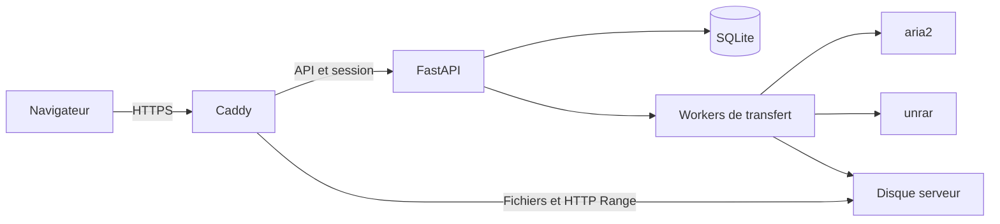

<div align="center">

# ☁ Nuage

**Colle tes liens. Vérifie les fichiers. Récupère le résultat.**

Un portail de transferts autonome pour les gros fichiers, avec reprise, extraction RAR et téléchargement de dossiers en ZIP.

[](https://github.com/fiftycommit/nuage/actions/workflows/ci.yml)
[](https://github.com/fiftycommit/nuage/actions/workflows/deploy.yml)

</div>

## Le parcours

1. Colle un lien, ou tous les liens d'une archive `part01.rar`, `part02.rar`…
2. Vérifie le nom, la taille et la disponibilité avant de confirmer.
3. Suis le débit, les octets reçus, le total et le pourcentage restant.
4. Récupère les fichiers séparément ou prépare un ZIP du dossier entier.

Les tâches continuent lorsque le navigateur est fermé. Les fichiers prêts sont conservés **5 jours** ; la date de suppression et l'espace libre sont visibles dans l'interface.

## Aperçu

Les captures sont produites automatiquement par la CI à partir du véritable frontend, avec des **données fictives**. Elles sont publiées dans la branche `screenshots` après validation ; les images ci-dessous apparaissent après la première exécution réussie.

### Ajouter et vérifier des liens


### Suivre ses transferts et récupérer les fichiers


<details>
<summary>Voir la version mobile</summary>


</details>

## Ce que fait Nuage

| Fonction | Comportement |
|---|---|
| Vérification | Métadonnées avant confirmation ; le contenu complet n'est pas téléchargé |
| Gros fichiers | Téléchargement via aria2, avec reprise et contrôle de taille |
| Archive RAR multipartie | Vérifie la numérotation, télécharge toutes les parties, puis extrait |
| Archive protégée | Mot de passe d'archive distinct du mot de passe du site ; reprise d'extraction possible |
| Progression | Débit courant, téléchargé/total et pourcentage restant par fichier |
| Dossier complet | ZIP sans recompression, créé en arrière-plan avec progression |
| Bibliothèque | Nom affiché modifiable, liens de téléchargement et tuiles repliables par fichier |
| Conservation | Suppression automatique des résultats et du ZIP après 5 jours |
| Accès | Mot de passe partagé, cookie de session signé ; contrôle de session aussi sur les fichiers |

Le nom modifié dans la bibliothèque est un nom d'affichage : les chemins de stockage internes restent associés à l'identifiant de tâche. Le repli des tuiles est mémorisé dans le navigateur par tâche et chemin de fichier.

### Hébergeurs

- **MediaFire** : dépend du helper `mediafire-get` installé séparément sur le serveur. Le code de ce helper n'est pas inclus dans cette version ; voir son contrat ci-dessous.
- **AkiraBox** : vérification du lien de partage et téléchargement via un lien direct signé encore valide. Lorsque l'hébergeur demande un CAPTCHA, l'utilisateur doit le compléter sur son site et fournir le lien direct.

Les autres hébergeurs ne sont pas pris en charge actuellement. Un lien temporaire peut expirer avant sa prise en charge dans la file.

## Démarrer en local

Prérequis : **Python 3.12+**, Node.js 24 pour les tests frontend, `aria2c` et `unrar` pour les transferts et l'extraction. Nuage écoute sur `127.0.0.1` ; un proxy HTTPS sert l'installation accessible sur Internet.

```sh
python3 -m venv .venv
.venv/bin/pip install -r requirements-dev.txt
.venv/bin/python scripts/init-env.py
.venv/bin/uvicorn app:app --env-file .env --host 127.0.0.1 --port 8765
```

Ouvre ensuite `http://127.0.0.1:8765`. Le script demande ton mot de passe sans l'afficher et écrit une configuration `.env` privée, sans écraser un fichier existant. Le backend refuse de démarrer si les deux secrets obligatoires sont absents ou trop courts.

| Variable | Utilisation |
|---|---|
| `PORTAL_PASSWORD` | Mot de passe partagé du site, 8 caractères minimum |
| `PORTAL_SESSION_SECRET` | Clé de signature de session, au moins 32 caractères |
| `PORTAL_ROOT` | Base de données et stockage ; `./data` en développement, `/data/transfer-portal` sur la VM |
| `PORTAL_MEDIAFIRE_HELPER` | Chemin du helper MediaFire, par défaut `/usr/local/bin/mediafire-get` |

`.env.example` contient uniquement des champs vides et des chemins génériques. `.env`, les clés privées, les bases SQLite et les fichiers téléchargés sont exclus de Git. La base contient des informations privées, notamment les liens source et les mots de passe d'archives jusqu'à leur purge : elle ne doit pas être publiée.

### Contrat du helper MediaFire

Le serveur existant fournit un exécutable Python `mediafire-get`. Pour une nouvelle installation, fournis un helper compatible et configure `PORTAL_MEDIAFIRE_HELPER` :

- `mediafire-get --probe URL` doit renvoyer `Fichier : NOM` et `Type : MIME; taille : N octets`, sans télécharger le fichier complet.
- Le module doit exposer `resolve_link(url, name)` renvoyant cinq valeurs, dont les trois dernières sont la taille attendue, le référent et le lien direct.
- Le helper est conservé à l'extérieur du code du portail lors des déploiements.

## Architecture



Le frontend est en HTML/CSS/JavaScript, sans framework ni compilation. `file-tiles.js` fournit le composant de tuile réutilisable. Caddy sert les gros fichiers directement, après vérification de la session, avec reprise HTTP Range.

Le système fonctionne avec un **compte partagé** : les personnes qui connaissent le mot de passe accèdent à la même bibliothèque. Il n'y a pas de séparation par utilisateur. Le backend limite un lot à 30 liens et 400 Go et vérifie l'espace libre avant de le lancer.

## Validation et CI

```sh
PYTHON_BIN=.venv/bin/python sh scripts/pre-push-check.sh
```

Cette commande est utilisée par GitHub Actions. Elle vérifie la syntaxe, les tuiles frontend, l'authentification, les cookies, les accès privés, le blocage des nouvelles tâches pendant un déploiement, les métadonnées publiques et les chemins d'archives. Les tests utilisent une base temporaire et ne téléchargent aucun fichier réel.

La CI s'exécute sur les pull requests et les changements de `main`. Après réussite sur `main`, elle produit les trois captures avec Chromium et les publie dans une branche dédiée. Les actions GitHub sont fixées à des SHA vérifiés ; Dependabot propose leurs mises à jour.

Pour refaire les captures localement :

```sh
python3 scripts/capture-screenshots.py
# Linux :
python3 scripts/capture-screenshots.py --chrome /usr/bin/google-chrome
```

## Déploiement Azure

La livraison est destinée à une **installation Nuage existante** : utilisateur `transferportal`, service `transfer-portal`, code `/opt/transfer-portal`, configuration `/etc/transfer-portal.env`, données `/data/transfer-portal` et Caddy déjà configuré. Les modèles systemd et Caddy sont fournis dans le dépôt.

Le déploiement utilise **OIDC**, sans mot de passe Azure ni clé SSH dans GitHub. Une identité managée est autorisée uniquement sur la VM cible ; elle peut y exécuter des commandes administrateur. Le mot de passe du site et sa clé de session restent dans `/etc/transfer-portal.env`.

Après publication du dépôt, configure la liaison depuis un terminal authentifié à Azure et GitHub :

```sh
python3 scripts/setup-azure-oidc.py \
  --repo fiftycommit/nuage \
  --resource-group NOM_DU_RESOURCE_GROUP \
  --vm NOM_DE_LA_VM
```

Le script crée l'identité et sa fédération, attribue `Virtual Machine Contributor` au niveau de cette VM, limite l'environnement GitHub `production` à `main`, renseigne ses variables et active `NUAGE_AUTO_DEPLOY`. Il déclenche ensuite la CI. Les identifiants client/tenant/abonnement sont des paramètres, pas des secrets d'authentification.

Le sujet de la fédération est lu depuis les paramètres OIDC du dépôt GitHub, y compris les identifiants immuables du propriétaire et du dépôt utilisés pour les nouveaux dépôts. Le script refuse une personnalisation des claims ou une fédération existante incompatible au lieu de la remplacer.

Le workflow CD se déclenche uniquement après une CI réussie de `main` dans ce dépôt. Il récupère le **SHA exact validé**, prépare les dépendances hors du code actif, attend la fin des tâches pendant au plus 30 minutes, puis remplace le code. La vérification de `/api/health` exige ce SHA ; un échec restaure la version précédente. Les données et le fichier d'environnement restent à leur emplacement.

Pour la toute première mise à jour, fais partir le déploiement lorsque les transferts sont au repos : l'ancienne version peut ne pas encore connaître le marqueur de maintenance. Les versions suivantes refusent temporairement de nouvelles tâches pendant la livraison.

Pour suspendre la livraison automatique :

```sh
gh variable set NUAGE_AUTO_DEPLOY --repo fiftycommit/nuage --body false
```

Les anciens codes et environnements Python sont conservés sous `/opt/nuage-backups` et `/opt/nuage-venvs` pour le diagnostic et le retour arrière. Ils ne sont pas automatiquement purgés.

Références : [OIDC Azure](https://learn.microsoft.com/en-us/azure/developer/github/connect-from-azure-openid-connect), [Azure Run Command](https://learn.microsoft.com/en-us/azure/virtual-machines/linux/run-command), [sécurité des workflows GitHub](https://docs.github.com/en/actions/reference/security/secure-use).

## Stockage et coût

Un ZIP sans recompression nécessite approximativement autant d'espace supplémentaire que son contenu sur le serveur. Après téléchargement, il faut aussi prévoir la place du ZIP et, si tu l'extrais, du dossier sur ton appareil.

**Chaque téléchargement depuis Azure consomme du trafic sortant potentiellement facturable.** Relire ou retélécharger un fichier consomme à nouveau du trafic. Le prix dépend du volume, de la région et du contrat Azure ; vérifier la tarification avant un transfert massif.

La rétention de 5 jours concerne les résultats gérés par Nuage. Les fichiers placés manuellement ailleurs sur le disque ne sont pas gérés par cette purge. Un fichier prêt n'est supprimé que si le serveur fonctionne ; une VM désallouée ne peut pas exécuter le nettoyage.

## Publier ce projet

Après installation des dépendances et authentification à GitHub :

```sh
PYTHON_BIN=.venv/bin/python sh scripts/publish-github.sh fiftycommit/nuage
```

Le script crée un dépôt public si nécessaire, exécute les contrôles avant le push et refuse un dépôt parent ou une origine inattendue. Le projet est indépendant de getStage.
